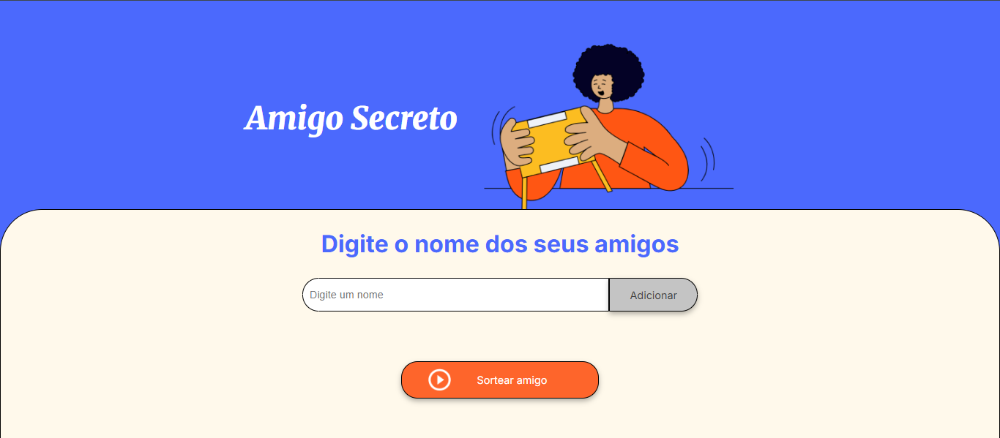

# Sorteio Amigo Secreto - Alura 🎯

Este é um projeto simples de "Amigo Secreto" desenvolvido como parte dos estudos de lógica de programação com JavaScript da Alura. A aplicação permite que o usuário adicione nomes a uma lista e, em seguida, sorteie um nome aleatório dentre os participantes.

***

## ✨ Funcionalidades

* **Adicionar Amigos**: Insira o nome de um amigo no campo de texto e clique em "Adicionar" para incluí-lo na lista.
* **Lista Dinâmica**: A lista de amigos é atualizada na tela em tempo real a cada adição.
* **Validação Simples**: O sistema impede a adição de nomes em branco.
* **Sorteio**: Com pelo menos dois amigos na lista, é possível sortear um nome aleatório.
* **Interface Limpa**: Design simples e intuitivo para facilitar a experiência do usuário.

***

## 🚀 Tecnologias Utilizadas

Este projeto foi construído utilizando tecnologias web fundamentais:

* **HTML5**: Para a estrutura e semântica da página.
* **CSS3**: Para a estilização, utilizando conceitos como Flexbox e variáveis CSS.
* **JavaScript**: Para toda a lógica de programação e manipulação do DOM.

***

## 🔧 Como Executar o Projeto

1.  Clone este repositório para sua máquina local.
2.  Abra o arquivo `index.html` em seu navegador de preferência.

***

## 📂 Estrutura de Arquivos
***
/
├── index.html       # Estrutura da página
├── style.css        # Estilização
├── app.js           # Lógica e interatividade
└── assets/
├── amigo-secreto.png
└── play_circle_outline.png

***

## 📝 Pontos de Melhoria

* **Sorteio Completo**: Implementar uma lógica que crie os pares de amigos (Ex: João tira Maria, Maria tira Pedro), garantindo que ninguém tire a si mesmo.
* **Evitar Nomes Duplicados**: Adicionar uma verificação para não permitir que o mesmo nome seja adicionado mais de uma vez.
* **Botão de Reiniciar**: Criar uma função para limpar a lista, permitindo um novo sorteio sem recarregar a página.
